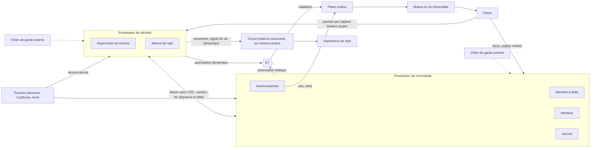

# ADR 0003 : architecture de calcul et canal de sécurité indépendant

| Champ | Valeur |
| --- | --- |
| Statut | **Acceptée** le 2026-10-09 par Camille Martin, approbatrice ([approbation](https://github.com/camille-martin-paris/clepsydre/pull/101#pullrequestreview-5471704223), révision `14676be`) ; retenue par l'auteur, Ambroise Leclerc. Acceptation consignée dans [reviews.md](../../software_development_file/reviews.md) |
| Date | 2026-10-09 |
| Issue | [#14](https://github.com/camille-martin-paris/clepsydre/issues/14) |
| Épique | [#12](https://github.com/camille-martin-paris/clepsydre/issues/12) |
| Dépend de | [ADR 0002](0002-principe-de-pompage.md) (pousse-seringue) |

> [!CAUTION]
> Clepsydre ne doit pas être utilisé sur un être humain ni sur un animal. Cette ADR fixe un principe d'architecture ; l'indépendance et l'efficacité du canal de sécurité restent à démontrer par l'analyse détaillée et par les essais.

## Contexte

L'analyse préliminaire des dangers transmet à cette ADR trois mesures structurantes ([constat 2](../requirements/preliminary-hazard-analysis.md#constats)) :

- **CTRL-001** : supervision du volume délivré par un canal de sécurité distinct du canal de commande (SYS-REQ-001, SYS-REQ-002) ;
- **CTRL-014** : chien de garde indépendant et autotests (SYS-REQ-017) ;
- **CTRL-016** : alarme technique de repli, indépendante du processeur principal (SYS-REQ-020).

Le logiciel est de [classe C](../../software_development_file/safety-classification.md) ; une classe inférieure ne peut être attribuée à un élément qu'avec une ségrégation documentée et vérifiée.

L'issue pose trois questions :

1. la séparation entre la commande temps réel et l'application (interface, journal, communication) ;
2. un superviseur capable d'arrêter le moteur sur une **défaillance unique** de la commande ;
3. le comportement sûr en cas de blocage ou de redémarrage de chaque processeur.

Cette ADR suppose le pousse-seringue retenu par l'[ADR 0002](0002-principe-de-pompage.md). Si une autre option était retenue, la mesure indépendante du volume (position du piston) serait à revoir ; le reste de l'architecture resterait valable.

## Critères

1. **Défaillance unique** : aucune défaillance unique de la commande, matérielle ou logicielle, ne doit conduire à une sur-perfusion ou à un arrêt non signalé sans que la pompe passe en état sûr dans le délai de SYS-REQ-002.
2. **Indépendance** du canal de sécurité : processeur, horloge, capteur de mesure et chemin de coupure distincts de ceux de la commande.
3. **Défaillances latentes** : une défaillance du canal de sécurité qui ne se manifeste pas d'elle-même doit être détectée avant la perfusion suivante.
4. **Simplicité** du canal de sécurité, pour qu'il puisse être vérifié à fond.
5. **Reproductibilité** open hardware, coût, et cohérence avec le simulateur ([#21](https://github.com/camille-martin-paris/clepsydre/issues/21)) : le logiciel de chaque processeur doit pouvoir s'exécuter sur l'hôte face au modèle physique.

## Options évaluées

| Option | Description | Évaluation |
| --- | --- | --- |
| A. Un microcontrôleur et un chien de garde externe | Commande, interface, journal et surveillance sur un même processeur | **Écartée** : pas de canal indépendant ; une erreur logicielle de calcul du débit n'est vue par aucun autre élément (critère 1, CTRL-001) |
| B. Microcontrôleur de commande et microcontrôleur de sécurité | Le premier assure commande, interface et journal ; le second, plus simple, mesure le volume par un capteur propre, peut couper le moteur et porte l'alarme de repli | **Proposée** |
| C. Processeur d'application, microcontrôleur de commande et microcontrôleur de sécurité | Comme B, avec l'interface, le journal et la communication sur un processeur d'application sous Linux | **Écartée pour le prototype** : l'interface affiche et saisit des valeurs de sécurité et reste de classe C ; Linux devient un SOUP volumineux dans un élément de classe C, sans gain de classe ; démarrage, consommation et coût plus élevés |
| D. Microcontrôleur de sûreté à double cœur en lockstep | Un processeur dont deux cœurs exécutent le même code et se comparent | **Écartée comme mesure unique** : détecte les défaillances aléatoires du cœur, mais pas une erreur de spécification ou de logiciel, commune aux deux cœurs, ni la défaillance d'un capteur ; outils souvent propriétaires. Utilisable plus tard comme processeur de commande, en complément de B |
| E. Superviseur en logique matérielle (CPLD ou FPGA) | Comparaison câblée de la position du piston à une consigne | **Écartée** : le calcul du volume attendu pour des programmations variables (modes, bolus, pauses) est complexe en logique câblée et introduit une discipline de conception supplémentaire |

## Décision

**Option B : deux microcontrôleurs, commande et sécurité.** Retenue par l'auteur et acceptée par l'approbatrice le 2026-10-09 ([reviews.md](../../software_development_file/reviews.md)). L'acceptation porte sur le principe d'architecture ; l'indépendance et l'efficacité du canal de sécurité restent à démontrer.

### Processeur de commande

- Il exécute la machine à états (SW-REQ-001), l'asservissement du moteur, la détection d'occlusion par la force, l'interface, le journal et les autotests.
- **Séparation entre temps réel et application** (question 1) : sur le même processeur, la commande et la surveillance s'exécutent dans des tâches de plus haute priorité que l'interface et le journal. L'unité de protection mémoire, si la cible en dispose, isole les données de commande. Cette séparation ne sert pas à abaisser la classe : l'interface reste de classe C, puisqu'elle affiche et saisit la programmation (RISK-007, RISK-008).
- Il a son propre chien de garde externe à fenêtre, rafraîchi selon SW-REQ-012.

### Processeur de sécurité

- **Mesure propre** : il lit un capteur linéaire de position du piston, distinct du codeur ou du comptage de pas du moteur, et calcule le volume délivré avec la section de la seringue identifiée ([ADR 0002](0002-principe-de-pompage.md#exigences-à-réviser-spécification-révision-b)).
- **Programmation** : avant la confirmation, le processeur de commande lui transmet la programmation (SW-REQ-013). Le processeur de sécurité la renvoie, et c'est **cette copie renvoyée** que l'écran de récapitulatif affiche. Le soignant confirme donc ce que le canal de sécurité surveillera. Elle est ensuite verrouillée ([Verrouillage de la programmation confirmée](#verrouillage-de-la-programmation-confirmée)).
- **Supervision** : il compare en continu le volume mesuré au volume attendu (SYS-REQ-001), et la vitesse du piston à la borne du mode actif sur une fenêtre courte, pour détecter un emballement avant que l'écart cumulé n'atteigne le seuil.
- **Coupure** : il commande la validation du pilote moteur par un **signal dynamique**, un créneau que le circuit de validation transforme en niveau. Un processeur bloqué, réinitialisé ou hors tension cesse de produire le créneau et coupe le moteur. La validation exige aussi le signal du processeur de commande (fonction ET matérielle).
- **Alarme de repli** (CTRL-016) : voir [Alarme de repli](#alarme-de-repli) ; son déclenchement ne dépend d'aucun processeur alimenté.
- Il a son propre oscillateur et son propre chien de garde externe. Son logiciel est volontairement réduit : pas d'interface, pas de journal complet ; il transmet ses événements au processeur de commande pour journalisation.

### Verrouillage de la programmation confirmée

Le code de détection d'erreur et le numéro de séquence de la liaison détectent les erreurs de **transmission**. Ils ne protègent pas contre un processeur de commande défaillant qui enverrait, après la confirmation, une nouvelle programmation erronée mais bien formée. Le processeur de sécurité applique donc les règles suivantes :

1. **Programmation figée** : à la confirmation, il enregistre la programmation renvoyée et confirmée : médicament et ses limites (dont celles du bolus), débit, volume à perfuser, débit de maintien de veine ouverte prévu par la bibliothèque, modèle de seringue. Tant qu'il valide le moteur, il **refuse toute nouvelle programmation**.
2. **Modification** : elle n'est possible qu'à partir d'un état où il a retiré sa validation (pause ou arrêt). Elle suit le même chemin : transmission, copie renvoyée affichée au récapitulatif, nouvelle confirmation.
3. **Confirmation observée de façon indépendante** : les touches Démarrer, Confirmer et Arrêt sont lues **directement** par le processeur de sécurité, par ses propres entrées. Il n'accepte une programmation que si un appui sur Confirmer, qu'il observe lui-même, suit le renvoi de la copie dans un délai borné. Un processeur de commande défaillant ne peut donc pas simuler la confirmation.
4. **Changements de mode admis pendant une perfusion** :

| Changement | Condition dans le processeur de sécurité |
| --- | --- |
| Pause, arrêt | Toujours admis, car dans le sens sûr ; il retire sa validation |
| Reprise après pause | Même programmation confirmée ; appui sur Démarrer observé par lui |
| Bolus | Appui observé par lui ; volume et débit bornés par les limites de bolus de la programmation confirmée ; supervision avec la borne du bolus, puis retour à la consigne continue confirmée |
| Fin de perfusion vers maintien de veine ouverte | Prévu dans la programmation confirmée ; transition déclenchée par le volume qu'il mesure |
| Purge | Uniquement avant le démarrage d'une perfusion (SYS-REQ-014), bornée par les limites de purge de la configuration de la pompe, qu'il détient ; appui observé par lui |

**Limite** : le soignant confirme l'écho affiché par le processeur de commande. Un affichage infidèle de cet écho relève de la défaillance de l'affichage, que cette architecture ne couvre pas (voir l'[analyse de défaillance unique](#analyse-de-défaillance-unique)).

### Alarme de repli

L'alarme de repli (CTRL-016, SYS-REQ-020) repose sur un **circuit d'alarme autonome**, distinct de l'avertisseur de l'interface, alimenté par sa propre réserve d'énergie (à dimensionner avec l'ADR [#15](https://github.com/camille-martin-paris/clepsydre/issues/15)) :

- **Armement** : le processeur de sécurité arme le circuit au démarrage d'une perfusion. L'état armé est mémorisé par le circuit lui-même, sur sa réserve, et ne dépend pas de l'alimentation des processeurs.
- **Déclenchement autonome** : armé, le circuit retentit dès qu'il ne reçoit plus le **signal de vie dynamique** du processeur de sécurité pendant un délai fixé par le matériel. Cela couvre un processeur de sécurité bloqué, réinitialisé ou hors tension, et la perte de l'alimentation générale. Aucun processeur alimenté n'est nécessaire au déclenchement.
- **Comportement par défaut** : circuit armé sans signal de vie, alarme. Le processeur de sécurité peut aussi le déclencher directement.
- **Désarmement** : seulement par une séquence explicite du processeur de sécurité, à l'arrêt normal de la perfusion. Hors perfusion, une mise hors tension normale ne déclenche donc pas d'alarme.
- **Test** : à chaque démarrage, le processeur de sécurité arme le circuit, interrompt son signal de vie et vérifie, par une mesure du courant de l'avertisseur, que l'alarme retentit, puis désarme. Un échec met la pompe hors service.

La durée minimale de l'alarme sur réserve est à fixer avec #15.

### Liaison entre les processeurs

Chaque message porte un code de détection d'erreur, un numéro de séquence et l'identité de l'émetteur ; chaque processeur surveille la réception périodique de l'autre. Un message erroné, manquant ou hors délai est une perte de lien. Ces protections portent sur la transmission ; un contenu erroné mais bien formé est traité par le [verrouillage de la programmation](#verrouillage-de-la-programmation-confirmée). Le délai de détection doit permettre l'état sûr en 1 s au plus (SYS-REQ-002). Le protocole est défini par l'ADR [#17](https://github.com/camille-martin-paris/clepsydre/issues/17).

### État sûr

État sûr au sens de SYS-REQ-002 : **pilote moteur non validé**, piston retenu (vis **irréversible**, de type trapézoïdal, qui ne peut pas être entraînée par le piston), alarme de priorité haute. L'état par défaut de chaque ligne de validation, processeur réinitialisé ou hors tension, est « non validé » (rappel au niveau inactif).

### Blocage et redémarrage (question 3)

| Événement | Réaction |
| --- | --- |
| Blocage du processeur de commande | Son chien de garde le réinitialise ; sa ligne de validation retombe ; le processeur de sécurité constate la perte de lien et déclenche l'alarme de repli. Au redémarrage, la perfusion ne reprend pas d'elle-même (SYS-REQ-038). |
| Blocage du processeur de sécurité | Le créneau cesse : le moteur est coupé. Pendant une perfusion, le signal de vie cesse aussi et le circuit d'alarme autonome retentit. Le processeur de commande constate la perte de lien, passe en état sûr et alarme. Son chien de garde réinitialise le processeur de sécurité. |
| Redémarrage d'un des deux processeurs | L'autre le constate par la perte de lien, puis par un numéro de démarrage différent. La perfusion ne reprend qu'après une nouvelle confirmation du soignant et une nouvelle transmission de la programmation au processeur de sécurité. |
| Perte totale d'alimentation | Les deux validations retombent. Pendant une perfusion, le circuit d'alarme autonome, armé et alimenté par sa réserve, ne reçoit plus le signal de vie et retentit sans intervention d'aucun processeur (SYS-REQ-020). |

## Analyse de défaillance unique

Analyse qualitative, au niveau de l'architecture ; elle sera détaillée par une AMDEC avec la conception électronique ([#57](https://github.com/camille-martin-paris/clepsydre/issues/57), [#59](https://github.com/camille-martin-paris/clepsydre/issues/59)).

| Défaillance unique | Effet sans mesure | Détection | Réaction | Reste à démontrer |
| --- | --- | --- | --- | --- |
| Erreur logicielle de la commande : débit calculé faux | Sur- ou sous-perfusion (RISK-001, RISK-002) | Processeur de sécurité : écart entre volume mesuré et attendu, vitesse hors borne | Coupure, alarme | Seuils et délais (SYS-REQ-001) |
| Programmation altérée par la commande avant transmission | Le canal de sécurité surveille une mauvaise consigne | Copie renvoyée affichée au récapitulatif et confirmée par le soignant | Pas de démarrage sans confirmation | Fidélité de l'affichage de l'écho (voir la ligne « Écran ») |
| Nouvelle programmation erronée, bien formée, envoyée par la commande après la confirmation | Le canal de sécurité surveillerait une consigne non confirmée | Programmation figée : refusée tant que le moteur est validé | Refus, état sûr, alarme | — |
| Confirmation simulée par la commande | Démarrage d'une programmation non confirmée | Touches lues directement par le processeur de sécurité | Programmation refusée | Lecture des touches : touche collée ou entrée défaillante, à détecter par la comparaison des deux lectures et au démarrage |
| Blocage ou emballement du processeur de commande | Moteur incontrôlé ou arrêté (RISK-012) | Chien de garde ; perte de lien ; supervision du volume | Validation retombée, coupure, alarme de repli | Délai de bout en bout ≤ 1 s |
| Horloge du processeur de commande fausse | Débit proportionnellement faux | Processeur de sécurité, sur son oscillateur propre : écart de volume ; dérive des périodes de la liaison | Coupure, alarme | Tolérance des oscillateurs |
| Pilote moteur défaillant : pas en trop, sens inversé, blocage | Sur-perfusion, aspiration ou arrêt | Supervision du volume et de la vitesse ; codeur moteur pour la commande | Coupure de la validation, alarme | Que la coupure de la validation arrête effectivement ce pilote, y compris en défaut |
| Validation du pilote collée à l'état actif | Aucune tant que rien d'autre ne défaille (défaillance latente) | Test de la coupure à chaque démarrage : chaque processeur retire sa validation et vérifie que le moteur ne tourne pas | Pompe hors service | Couverture du test |
| Capteur de force défaillant | Occlusion non détectée (RISK-005) | Plausibilité du capteur ; un piston bloqué fait perdre des pas au moteur, et le processeur de sécurité voit l'écart de volume | Alarme | Délai d'occlusion à bas débit par cette voie de secours |
| Capteur de position du canal de sécurité défaillant | Fausse alarme, ou surveillance aveugle | Plausibilité croisée avec le codeur moteur transmis par la commande ; valeur figée ou hors plage | Alarme (sens sûr) | Mode de défaillance « dérive lente » du capteur retenu |
| Processeur de sécurité défaillant sans arrêt | Surveillance perdue (latente) | Perte de lien ; autotests ; test de coupure au démarrage | État sûr, alarme | — |
| Avertisseur principal muet | Alarme non perçue (RISK-014) | Test des signaux d'alarme au démarrage (SW-REQ-010) | Pompe hors service | Détection en cours de perfusion |
| Circuit d'alarme autonome défaillant (ne retentit pas, ou ne s'arme pas) | Défaillance latente | Test au démarrage, avec mesure du courant de l'avertisseur | Pompe hors service | Couverture du test, autonomie de la réserve |
| Mémoire altérée | Comportement imprévisible | Autotests au démarrage et périodiques (SW-REQ-010, SW-REQ-011), mémoire à correction d'erreur si la cible le permet | État sûr | Couverture de diagnostic (SW-REQ-011) |
| Écran figé ou affichant une valeur fausse | Soignant mal informé (RISK-007, RISK-008) | **Non couverte par cette architecture** | — | À traiter avec l'interface et l'électronique ([#36](https://github.com/camille-martin-paris/clepsydre/issues/36), [#57](https://github.com/camille-martin-paris/clepsydre/issues/57)), par exemple par relecture de l'affichage ou indicateur d'activité |
| Rupture d'alimentation | Arrêt (RISK-010) | Surveillance de l'alimentation | État sûr par défaut, alarme de repli | Réserve d'énergie (#15) |

**Emballement avant détection** : entre le début d'un emballement et la coupure, le moteur peut délivrer un volume. La **vitesse mécanique maximale** du mécanisme doit donc être bornée par conception (rapport de réduction, fréquence de pas limitée par le matériel), de façon que ce volume reste sous une limite à fixer dans la révision des exigences.

**Défaillances doubles** : les défaillances latentes du canal de sécurité (validation collée, circuit d'alarme autonome défaillant, capteur de position dérivant) sont recherchées à chaque démarrage. Une défaillance double n'est donc pas couverte au cours d'une même perfusion ; la durée maximale d'une perfusion sans nouveau test est à fixer avec l'analyse détaillée.

## Conséquences

### Classification

- Les deux logiciels embarqués sont de **classe C**. Le canal de sécurité est une mesure de maîtrise des risques ; son indépendance n'abaisse la classe d'aucun élément tant qu'elle n'est pas démontrée (vérification, AMDEC).
- Après démonstration, la classe du logiciel de commande pourra être réexaminée selon l'IEC 62304 §4.3 ; le logiciel de sécurité restera de classe C.

### Exigences et analyse des dangers

À traiter après acceptation, dans des pull requests distinctes :

- **SYS-REQ-001** : préciser la mesure (position du piston par un capteur propre) et ajouter la supervision de la vitesse sur une fenêtre courte ;
- nouvelles exigences : **vitesse mécanique maximale bornée par conception** ; **coupure par signal dynamique et fonction ET** ; **état par défaut non validé** ; **test de la coupure et du circuit d'alarme autonome à chaque démarrage** ; **récapitulatif affichant la copie renvoyée par le canal de sécurité** ; **programmation figée dans le canal de sécurité après confirmation** ; **lecture directe des touches Démarrer, Confirmer et Arrêt par le canal de sécurité** ; **circuit d'alarme autonome armé pendant la perfusion** ;
- **SW-REQ-013** : préciser l'écho de la programmation, son verrouillage et les changements de mode admis ;
- exigences logicielles propres au processeur de sécurité, annoncées par la spécification ;
- analyse des dangers : causes et mesures ci-dessus ; la défaillance de l'affichage reste ouverte.

### Conception

- **Électronique** ([#57](https://github.com/camille-martin-paris/clepsydre/issues/57), [#59](https://github.com/camille-martin-paris/clepsydre/issues/59), [#60](https://github.com/camille-martin-paris/clepsydre/issues/60)) : deux microcontrôleurs, chacun avec son oscillateur et son chien de garde externe ; circuit de validation dynamique et fonction ET ; circuit d'alarme autonome (armement mémorisé, temporisation matérielle du signal de vie, avertisseur et réserve propres) ; touches Démarrer, Confirmer et Arrêt lues par les deux processeurs. La diversité des deux microcontrôleurs (familles ou fabricants différents) réduit les défaillances de cause commune ; elle est recommandée et sera tranchée avec #59.
- **Mécanique** ([#52](https://github.com/camille-martin-paris/clepsydre/issues/52)) : vis irréversible ; capteur linéaire de position du piston pour le canal de sécurité.
- **Logiciel** ([#24](https://github.com/camille-martin-paris/clepsydre/issues/24), [#29](https://github.com/camille-martin-paris/clepsydre/issues/29)) : deux exécutables, chacun avec une couche d'abstraction du matériel, pour s'exécuter sur la cible et sur l'hôte.
- **Simulateur** ([#21](https://github.com/camille-martin-paris/clepsydre/issues/21)) : exécute les deux logiciels face au modèle, avec la liaison simulée ; défauts injectables : blocage et redémarrage de chaque processeur, perte ou altération de messages, dérive d'horloge, défaillance du pilote et des capteurs.
- **Interfaces** ([#17](https://github.com/camille-martin-paris/clepsydre/issues/17)) : protocole de la liaison et délais.

## Limites

- Analyse qualitative ; aucune probabilité ni couverture de diagnostic n'est encore estimée.
- Les délais (détection, coupure, liaison) et le volume maximal avant coupure sont à fixer et à mesurer.
- Le choix des composants n'est pas fait ici.

## Références

- [Analyse préliminaire des dangers](../requirements/preliminary-hazard-analysis.md), constat 2
- [Spécification des exigences](../requirements/requirements-specification.md)
- [Classification de sécurité du logiciel](../../software_development_file/safety-classification.md)
- IEC 62304:2006+A1:2015, §4.3 et §5.3
- IEC 60601-1:2005+A1:2012+A2:2020, notion de condition de premier défaut
